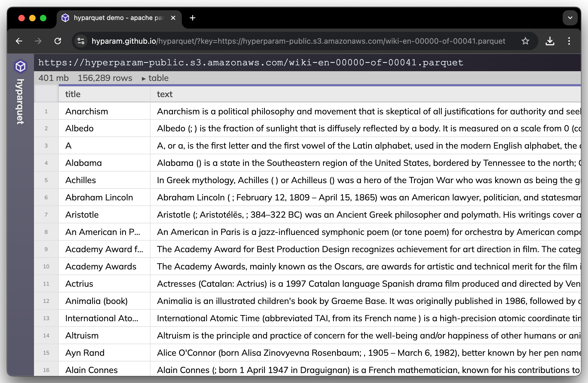

# hyparquet


[](https://www.npmjs.com/package/hyparquet)
[](https://github.com/hyparam/hyparquet/actions)
[](https://opensource.org/licenses/MIT)
[](https://www.npmjs.com/package/hyparquet?activeTab=dependencies)


Dependency free since 2023!

## What is hyparquet?

Hyparquet is a lightweight, pure JavaScript library for parsing [Apache Parquet](https://parquet.apache.org) files. Apache Parquet is a popular columnar storage format that is widely used in data engineering, data science, and machine learning applications for efficiently storing and processing large datasets.

Hyparquet allows you to read and extract data from Parquet files directly in JavaScript environments, both in Node.js and in the browser, without any dependencies. Designed for performance and ease of use, hyparquet is ideal for data engineering, data science, and machine learning applications that require efficient data processing.

## Demo

Online parquet file reader demo available at:

https://hyparam.github.io/hyparquet/

[](https://hyparam.github.io/hyparquet/)

## Features

1. **Performant**: Designed to efficiently process large datasets by only loading the required data, making it suitable for big data and machine learning applications.
2. **Browser-native**: Built to work seamlessly in the browser, opening up new possibilities for web-based data applications and visualizations.
3. **Dependency-free**: Hyparquet has zero dependencies, making it lightweight and easy to install and use in any JavaScript project.
4. **TypeScript support**: The library is written in jsdoc-typed JavaScript and provides TypeScript definitions out of the box.
5. **Flexible data access**: Hyparquet allows you to read specific subsets of data by specifying row and column ranges, giving fine-grained control over what data is fetched and loaded.

## Why hyparquet?

Why make a new parquet parser?
First, existing libraries like [parquetjs](https://github.com/ironSource/parquetjs) are officially "inactive".
Importantly, they do not support the kind of stream processing needed to make a really performant parser in the browser.
And finally, no dependencies means that hyparquet is lean, and easy to package and deploy.

## Usage

Install the hyparquet package from npm:

```bash
npm install hyparquet
```

## Reading Data

### Node.js

To read the entire contents of a parquet file in a node.js environment:

```javascript
const { asyncBufferFromFile, parquetRead } = await import('hyparquet')
await parquetRead({
  file: await asyncBufferFromFile(filename),
  onComplete: data => console.log(data)
})
```

### Browser

Hyparquet supports asynchronous fetching of parquet files over a network.

```js
const { asyncBufferFromUrl, parquetRead } = await import('https://cdn.jsdelivr.net/npm/hyparquet/src/hyparquet.min.js')
const url = 'https://hyperparam-public.s3.amazonaws.com/bunnies.parquet'
await parquetRead({
  file: await asyncBufferFromUrl(url),
  onComplete: data => console.log(data)
})
```

## Metadata

You can read just the metadata, including schema and data statistics using the `parquetMetadata` function:

```javascript
const { parquetMetadata } = await import('hyparquet')
const fs = await import('fs')

const buffer = fs.readFileSync('example.parquet')
const arrayBuffer = new Uint8Array(buffer).buffer
const metadata = parquetMetadata(arrayBuffer)
```

If you're in a browser environment, you'll probably get parquet file data from either a drag-and-dropped file from the user, or downloaded from the web.

To load parquet data in the browser from a remote server using `fetch`:

```javascript
import { parquetMetadata } from 'hyparquet'

const res = await fetch(url)
const arrayBuffer = await res.arrayBuffer()
const metadata = parquetMetadata(arrayBuffer)
```

To parse parquet files from a user drag-and-drop action, see example in [index.html](index.html).

## Filtering by Row and Column

To read large parquet files, it is recommended that you filter by row and column.
Hyparquet is designed to load only the minimal amount of data needed to fulfill a query.
You can filter rows by number, or columns by name,
and columns will be returned in the same order they were requested:

```javascript
import { parquetRead } from 'hyparquet'

await parquetRead({
  file,
  columns: ['colB', 'colA'], // include columns colB and colA
  rowStart: 100,
  rowEnd: 200,
  onComplete: data => console.log(data),
})
```

## Column names

By default, data returned in the `onComplete` function will be one array of columns per row.
If you would like each row to be an object with each key the name of the column, set the option `rowFormat` to `object`.

```javascript
import { parquetRead } from 'hyparquet'

await parquetRead({
  file,
  rowFormat: 'object',
  onComplete: data => console.log(data),
})
```

## Advanced Usage

### AsyncBuffer

Hyparquet supports asynchronous fetching of parquet files over a network.
You can provide an `AsyncBuffer` which is like a js `ArrayBuffer` but the `slice` method returns `Promise<ArrayBuffer>`.

```typescript
interface AsyncBuffer {
  byteLength: number
  slice(start: number, end?: number): Promise<ArrayBuffer>
}
```

You can read parquet files asynchronously using HTTP Range requests so that only the necessary byte ranges from a `url` will be fetched:

```javascript
import { parquetRead } from 'hyparquet'

const url = 'https://hyperparam-public.s3.amazonaws.com/wiki-en-00000-of-00041.parquet'
const byteLength = 420296449
await parquetRead({
  file: { // AsyncBuffer
    byteLength,
    async slice(start, end) {
      const headers = new Headers()
      headers.set('Range', `bytes=${start}-${end - 1}`)
      const res = await fetch(url, { headers })
      return res.arrayBuffer()
    },
  },
  onComplete: data => console.log(data),
})
```

## Supported Parquet Files

The parquet format is known to be a sprawling format which includes options for a wide array of compression schemes, encoding types, and data structures.

Supported parquet encodings:
 - [X] PLAIN
 - [X] PLAIN_DICTIONARY
 - [X] RLE_DICTIONARY
 - [X] RLE
 - [X] BIT_PACKED
 - [X] DELTA_BINARY_PACKED
 - [X] DELTA_BYTE_ARRAY
 - [X] DELTA_LENGTH_BYTE_ARRAY
 - [X] BYTE_STREAM_SPLIT

## Compression

Supporting every possible compression codec available in parquet would blow up the size of the hyparquet library. In practice, most parquet files use snappy compression.

Parquet compression types supported by default:
 - [X] Uncompressed
 - [X] Snappy
 - [ ] GZip
 - [ ] LZO
 - [ ] Brotli
 - [ ] LZ4
 - [ ] ZSTD
 - [ ] LZ4_RAW

You can provide custom compression codecs using the `compressors` option.

## hysnappy

The most common compression codec used in parquet is snappy compression.
Hyparquet includes a built-in snappy decompressor written in javascript.

We developed [hysnappy](https://github.com/hyparam/hysnappy) to make parquet parsing even faster.
Hysnappy is a snappy decompression codec written in C, compiled to WASM.

To use hysnappy for faster parsing of large parquet files, override the `SNAPPY` compressor for hyparquet:

```js
import { parquetRead } from 'hyparquet'
import { snappyUncompressor } from 'hysnappy'

await parquetRead({
  file,
  compressors: {
    SNAPPY: snappyUncompressor(),
  },
  onComplete: console.log,
})
```

Parsing a [420mb wikipedia parquet file](https://huggingface.co/datasets/wikimedia/wikipedia/resolve/main/20231101.en/train-00000-of-00041.parquet) using hysnappy reduces parsing time by 40% (4.1s to 2.3s).

## hyparquet-compressors

You can include support for ALL parquet compression codecs using the [hyparquet-compressors](https://github.com/hyparam/hyparquet-compressors) library.

```js
import { parquetRead } from 'hyparquet'
import { compressors } from 'hyparquet-compressors'

await parquetRead({ file, compressors, onComplete: console.log })
```

## References

 - https://github.com/apache/parquet-format
 - https://github.com/apache/parquet-testing
 - https://github.com/apache/thrift
 - https://github.com/apache/arrow
 - https://github.com/dask/fastparquet
 - https://github.com/duckdb/duckdb
 - https://github.com/google/snappy
 - https://github.com/ironSource/parquetjs
 - https://github.com/zhipeng-jia/snappyjs

## Contributions

Contributions are welcome!

Hyparquet development is supported by an open-source grant from Hugging Face :hugs:
