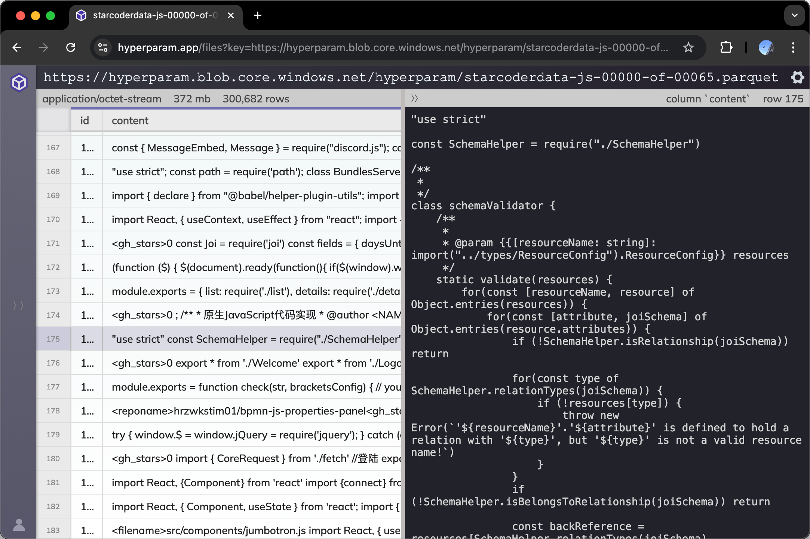

# hyparquet


[](https://www.npmjs.com/package/hyparquet)
[](https://www.npmjs.com/package/hyparquet)
[](https://github.com/hyparam/hyparquet/actions)
[](https://opensource.org/licenses/MIT)

[](https://www.npmjs.com/package/hyparquet?activeTab=dependencies)

Dependency free since 2023!

## What is hyparquet?

**Hyparquet** is a lightweight, dependency-free, pure JavaScript library for parsing [Apache Parquet](https://parquet.apache.org) files. Apache Parquet is a popular columnar storage format that is widely used in data engineering, data science, and machine learning applications for efficiently storing and processing large datasets.

Hyparquet aims to be the world's most compliant parquet parser. And it runs in the browser.

## Parquet Viewer

**Try hyparquet online**: Drag and drop your parquet file onto [hyperparam.app](https://hyperparam.app) to view it directly in your browser. This service is powered by hyparquet's in-browser capabilities.

[](https://hyperparam.app/)

## Features

1. **Browser-native**: Built to work seamlessly in the browser, opening up new possibilities for web-based data applications and visualizations.
2. **Performant**: Designed to efficiently process large datasets by only loading the required data, making it suitable for big data and machine learning applications.
3. **TypeScript**: Includes TypeScript definitions.
4. **Dependency-free**: Hyparquet has zero dependencies, making it lightweight and easy to use in any JavaScript project. Only 9.7kb min.gz!
5. **Highly Compliant:** Supports all parquet encodings, compression codecs, and can open more parquet files than any other library.

## Why hyparquet?

Parquet is widely used in data engineering and data science for its efficient storage and processing of large datasets. What if you could use parquet files directly in the browser, without needing a server or backend infrastructure? That's what hyparquet enables.

Existing JavaScript-based parquet readers (like [parquetjs](https://github.com/ironSource/parquetjs)) are no longer actively maintained, may not support streaming or in-browser processing efficiently, and often rely on dependencies that can inflate your bundle size.
Hyparquet is actively maintained and designed with modern web usage in mind.

## Demo

Check out a minimal parquet viewer demo that shows how to integrate hyparquet into a react web application using [HighTable](https://github.com/hyparam/hightable).

 - **Live Demo**: [https://hyparam.github.io/demos/hyparquet/](https://hyparam.github.io/demos/hyparquet/)
 - **Demo Source Code**: [https://github.com/hyparam/demos/tree/master/hyparquet](https://github.com/hyparam/demos/tree/master/hyparquet)

## Quick Start

### Node.js Example

To read the contents of a local parquet file in a node.js environment use `asyncBufferFromFile`:

```javascript
const { asyncBufferFromFile, parquetReadObjects } = await import('hyparquet')

const file = await asyncBufferFromFile(filename)
const data = await parquetReadObjects({ file })
```

Note: hyparquet is published as an ES module, so dynamic `import()` may be required on the command line.

### Browser Example

In the browser use `asyncBufferFromUrl` to wrap a url for reading asynchronously over the network.
It is recommended that you filter by row and column to limit fetch size:

```javascript
const { asyncBufferFromUrl, parquetReadObjects } = await import('https://cdn.jsdelivr.net/npm/hyparquet/src/hyparquet.min.js')

const url = 'https://hyperparam-public.s3.amazonaws.com/bunnies.parquet'
const file = await asyncBufferFromUrl({ url }) // wrap url for async fetching
const data = await parquetReadObjects({
  file,
  columns: ['Breed Name', 'Lifespan'],
  rowStart: 10,
  rowEnd: 20,
})
```

## Parquet Writing

To create parquet files from javascript, check out the [hyparquet-writer](https://github.com/hyparam/hyparquet-writer) package.

## Advanced Usage

### Reading Metadata

You can read just the metadata, including schema and data statistics using the `parquetMetadataAsync` function.
To load parquet metadata in the browser from a remote server:

```javascript
import { parquetMetadataAsync, parquetSchema } from 'hyparquet'

const file = await asyncBufferFromUrl({ url })
const metadata = await parquetMetadataAsync(file)
// Get total number of rows (convert bigint to number)
const numRows = Number(metadata.num_rows)
// Get nested table schema
const schema = parquetSchema(metadata)
// Get top-level column header names
const columnNames = schema.children.map(e => e.element.name)
```

You can also read the metadata synchronously using `parquetMetadata` if you have an array buffer with the parquet footer:

```javascript
import { parquetMetadata } from 'hyparquet'

const metadata = parquetMetadata(arrayBuffer)
```

### AsyncBuffer

Hyparquet accepts argument `file` of type `AsyncBuffer` which is like a js `ArrayBuffer` but the `slice` method can return `Promise<ArrayBuffer>`.
You can pass an `ArrayBuffer` anywhere that an `AsyncBuffer` is expected, if you have the entire file in memory.

```typescript
type Awaitable<T> = T | Promise<T>
interface AsyncBuffer {
  byteLength: number
  slice(start: number, end?: number): Awaitable<ArrayBuffer>
}
```

You can define your own `AsyncBuffer` to create a virtual file that can be read asynchronously. In most cases, you should probably use `asyncBufferFromUrl` or `asyncBufferFromFile`.

### parquetRead vs parquetReadObjects

#### parquetReadObjects

`parquetReadObjects` is a convenience wrapper around `parquetRead` that returns the complete rows as `Promise<Record<string, any>[]>`. This is the simplest way to read parquet files.

```typescript
parquetReadObjects({ file }): Promise<Record<string, any>[]>
```

#### parquetRead

`parquetRead` is the "base" function for reading parquet files.
It returns a `Promise<void>` that resolves when the file has been read or rejected if an error occurs.
Data is returned via `onComplete` or `onChunk` callbacks passed as arguments.

The reason for this design is that parquet is a column-oriented format, and returning data in row-oriented format requires transposing the column data. This is an expensive operation in javascript. If you don't pass in an `onComplete` argument to `parquetRead`, hyparquet will skip this transpose step and save memory.

The `onChunk` callback allows column-oriented data to be streamed back as it is read.

```typescript
interface ColumnData {
  columnName: string
  columnData: ArrayLike<any>
  rowStart: number
  rowEnd: number
}
function onChunk(chunk: ColumnData): void {
  console.log(chunk)
}
await parquetRead({ file, onChunk })
```

### Authorization

Pass the `requestInit` option to `asyncBufferFromUrl` to provide authentication information to a remote web server. For example:

```javascript
const requestInit = { headers: { Authorization: 'Bearer my_token' } }
const file = await asyncBufferFromUrl({ url, requestInit })
```

### Returned row format

By default, data returned by `parquetRead` in the `onComplete` function will be one **array** of columns per row.
If you would like each row to be an **object** with each key the name of the column, set the option `rowFormat` to `object`.

```javascript
import { parquetRead } from 'hyparquet'

await parquetRead({
  file,
  rowFormat: 'object',
  onComplete: data => console.log(data),
})
```

The `parquetReadObjects` function defaults to returning an array of objects.

## Supported Parquet Files

The parquet format is known to be a sprawling format which includes options for a wide array of compression schemes, encoding types, and data structures.
Hyparquet supports all parquet encodings: plain, dictionary, rle, bit packed, delta, etc.

**Hyparquet is the most compliant parquet parser on earth** — hyparquet can open more files than pyarrow, rust, and duckdb.

## Compression

By default, hyparquet supports uncompressed and snappy-compressed parquet files.
To support the full range of parquet compression codecs (gzip, brotli, zstd, etc), use the [hyparquet-compressors](https://github.com/hyparam/hyparquet-compressors) package.

| Codec         | hyparquet | with hyparquet-compressors |
|---------------|-----------|----------------------------|
| Uncompressed  | ✅        | ✅                         |
| Snappy        | ✅        | ✅                         |
| GZip          | ❌        | ✅                         |
| LZO           | ❌        | ✅                         |
| Brotli        | ❌        | ✅                         |
| LZ4           | ❌        | ✅                         |
| ZSTD          | ❌        | ✅                         |
| LZ4_RAW       | ❌        | ✅                         |

### hysnappy

For faster snappy decompression, try [hysnappy](https://github.com/hyparam/hysnappy), which uses WASM for a 40% speed boost on large parquet files.

### hyparquet-compressors

You can include support for ALL parquet `compressors` plus hysnappy using the [hyparquet-compressors](https://github.com/hyparam/hyparquet-compressors) package.


```javascript
import { parquetReadObjects } from 'hyparquet'
import { compressors } from 'hyparquet-compressors'

const file = await asyncBufferFromFile(filename)
const data = await parquetReadObjects({ file, compressors })
```

## References

 - https://github.com/apache/parquet-format
 - https://github.com/apache/parquet-testing
 - https://github.com/apache/thrift
 - https://github.com/apache/arrow
 - https://github.com/dask/fastparquet
 - https://github.com/duckdb/duckdb
 - https://github.com/google/snappy
 - https://github.com/hyparam/hightable
 - https://github.com/hyparam/hysnappy
 - https://github.com/hyparam/hyparquet-compressors
 - https://github.com/ironSource/parquetjs
 - https://github.com/zhipeng-jia/snappyjs

## Contributions

Contributions are welcome!
If you have suggestions, bug reports, or feature requests, please open an issue or submit a pull request.

Hyparquet development is supported by an open-source grant from Hugging Face :hugs:
